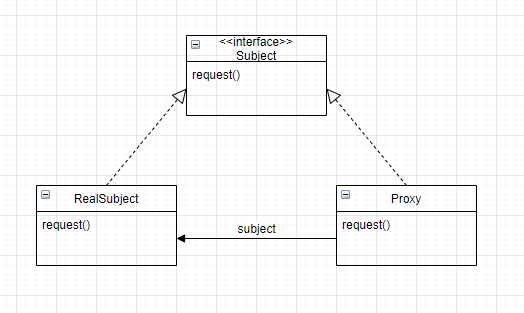

# Head First Design Patterns

> 書名：《*Head First Design Patterns*》
>
> 筆記作者：葉高緯 Wei the Shinobi

之前看了《*Head First Java*》，我覺得Head First系列都很讚。

# 介紹設計模式

設計模式讓我們與其他人討論時更方便，

現在有一個鴨子父類，

有很多不同的鴨子子類會繼承，

但是不同的鴨子有不同的行為，

像是呱呱叫和飛翔，

個別修改不同的行為對於日後維護困難。

## 把變動部分封裝起來

我們可以把呱呱叫和飛翔從鴨子中取出，

建立一個新的類別。

> 封裝呱呱叫和飛翔的行為。

## 針對介面寫程式，不是針對實踐寫程式

在鴨子class中，

選擇行為的介面。

```java
FlyBehavior fly = new FlyNoWay;
```

從介面呼叫方法易於維護與擴充。

## 多用合成，少用繼承

我們把行為的介面和鴨子組合起來，

而不是把繼承行為，

組合更加靈活，

還可以動態指定不同的行為。

> 「有一個」比「是一個」更好。

## 策略模式

定義了演算法家族，個別封裝，讓它們可以替換，演算法的變動不會影響使用演算法的程式。

舉例：

一個角色有一個武器行為，

做出一個武器行為介面，

可以實作出不同武器的武器行為，

還可以使用角色的`setWeapon`方法來替換武器。

# 觀察者模式

定義了物件之間的一對多關係，當一個物件改變狀態，其他相依者都會收到通知並更新。

就像是報社和訂閱者，

訂閱可以收到報紙，

也可以取消訂閱就不再收到報紙。

設計主題介面與觀察者介面。

## 設計時，盡量讓需要互動的物件之間關係鬆綁

當兩個物件被鬆綁，

依然可以互動，

但是不太清楚彼此的細節。

## 通知變更

有時候資訊頻繁改動，

可以設定`setChange`方法，

自訂改動的幅度才通知觀察者。

# 裝飾者模式

動態地將責任加諸於物件上。若要擴充功能，裝飾者提供比繼承更有彈性的選擇。

讓裝飾者與被裝飾者能使用多型，

繼承同一個類，

再建構式中實例化父類。

範例：

```java
Drink drink = new coffee();
drink = new Mocha(drink);
drink = new Whip(drink);
```

這看起來有沒有像什麼？

就是Java的IO流

`FileInputStream`是被裝飾者

像是`BufferedInputStream`之類的裝飾者都繼承了`FilterInputStream`

可以裝飾`FileInputStream`

而且他們全都繼承自同一個抽象類

了解了這些你甚至可以繼承`FilterInputStream`來撰寫自己的裝飾者

## 缺點

- 大量的小類別不容易被理解設計方式

如同第一次接觸IO庫，

無法輕易地知道用法。

- 裝飾者實體化元件時，將增加程式的複雜度

要一直包包包

# 工廠模式

工廠模式將建立物件的程式碼集中在一個物件或行為中，

在進行物件實體化時只會用到介面，

不再依賴實踐類，

讓程式更有彈性方便修改。

```java
Duck dukc;

if(a) {
    duck = new RubberDuck();
} else if (b) {
    duck = new NormalDuck();
} else if (c) {
    // ...
}
```

我們針對介面寫程式，

介面透過多型來實例化不同的實現類，

但如果已有大量的實現類，

要加入新的實現類就要**修改舊的程式碼**，

而這正是我們不樂見的，

所以**我們找出會改變的地方，然後將這部分抽離出來，**

所以工廠誕生了。

## 簡單工廠

單純的把剛剛那段示範程式碼抽取出來，

寫進一個新的類中，

在需要用到工廠的時候呼叫。

簡單工廠其實不是設計模式，反而比較像是一種編程習慣。

## 工廠模式

定義一個建立物件的介面，但由子類別**決定**要實體化的類別為何。工廠方法讓類別把實體化的動作，交由子類別進行。

所謂的「決定」，並不是指模式允許子類別在執行期作決定，

而是指：在撰寫創建者類別（工廠）時，不需要知道實際建立的產品為何，

選擇哪個子類別（工廠），自然就決定了實際建立的產品為何。

## 依賴反轉守則

**依賴抽象類別，不要依賴實現類別。**

舉例來說：

披薩店依賴於一堆不同口味的特色披薩，

不如依賴於披薩抽象，

讓特色披薩實作披薩抽象。

那反轉在哪？

本來披薩店直接依賴一堆特色披薩（低階元件），

現在披薩店依賴披薩抽象，

而特色披薩依賴披薩抽象，

相依被顛倒了。

### 指導方針

- 變數不可以持有實現類的參考

  ​	這就是為什麼我們不使用`new`，改用工廠迴避。

- 不要讓類別繼承自實現類

- 不要讓子類`override`父類的方法

  ​	如果這樣，說明這不適合繼承。

當然不可能完全遵守這些守則，

否則你什麼都寫不出來。

## 抽象工廠

工廠的工廠，抽象工廠定義了我們該怎麼蓋工廠。

抽象工廠提供介面，

以實踐各式各樣的工廠，

工廠方法就潛伏在抽象工廠中。

### 比較抽象工廠與工廠方法

- 工廠提供介面建立出產品`createPizza()`
- 抽象工廠提供介面建立一個產品家族，像是披薩的原物料，原物料又會有工廠。

# 單例模式

確保一個類別只有一個實體，並給它一個存取的global point。

有些物件只需要一個，如果有多個實體，就會出事。

## 基本

私有建構式

```java
public MyClass {
    private MyClass(){}
    
    public static MyClass getInstance(){
        return new MyClass();
    }
}
```

## 多執行緒的問題

**Lazy Instantiaze**

```java
private static MyClass myClass;
public static MyClass getInstance(){
	if (myClass == null) {
        myClass = new MyClass();
    }
    return myClass;
}
```

多執行緒處理最基本的單例模式有機會出問題，

例如`getInstance()`產生多個實體，

我們可以在方法加上`synchronized`關鍵字。

雖然這個方法簡單又有效，

但是加上這個關鍵字會拖垮效能，

因為我們只需要在第一次產生實體時排隊就好，

不需要每一次。

### 解決辦法

- 使用`synchronized`關鍵字不管效能

如果效能對你來說沒那麼重的話。

- 不用拖延實體化的作法

```java
// 直接建立一個
private static MyClass myClass = new MyClass();

public static MyClass getInstance(){
    return myClass;
}
```

- 雙重鎖

原理：先檢查是否實體化，如果還沒，才會同步化，這樣就只會進行一次同步化。

```java
// 加上volatile關鍵字確保可見性
private volatile static MyClass myClass;

public static MyClass getInstance(){
    // 檢查是否實體化，如果不存在才會進入同步化區塊。
	if (myClass == null) {
        synchronized (Singleton.class) {
            if (myClass == null) {
                myClass = new MyClass();
            }
        }
    }
    
    return myClass;
}
```

# 命令模式

將請求封裝成物件。

像是一間餐廳，

你把菜單給服務生，

服務生把菜單給廚師，

而服務生不會知道菜單是什麼。

或者說是遙控器和家電，

你按下遙控器，

遙控器調用封裝好的命令介面給電器，

電器執行它該做的，

所以我們要寫一個命令介面，

還需要調用者，

然後把命令介面傳進調用者中，

調用者負責執行。

# 轉接器模式與表象模式

## 轉接器模式

將一個類別的介面，轉換成另一個介面。

轉接器不難理解，

插頭和插座的形狀不一樣，

就需要轉接器，

讓我們不用改寫插頭或插座。

### 物件轉接

```java
c.lass TurkeyAdapter implements Duck {
    // ...
    public void quack() {
        turkey.gobble(); // 呼叫火雞的方法
    }
}
```

這段程式碼中，

我們把火雞透過轉接器，

轉換成鴨子。

### 類別轉接

不使用合成改變被轉接者，

而是**多重繼承**被轉接者和目標類別，

設計出類別轉接器。

不過關鍵就在**多重繼承**，

Java是無法多重繼承的，

但也許有天寫C++的時候可以用到。

---

不論哪種方法，

客戶都會認為他在跟鴨子溝通，

但其實是轉接過的火雞。

## Facade 表象模式

提供一個統一的介面，存取次系統中的一群介面。

表象用於簡化介面，

本來你要調用一堆次系統的介面，

但表象把它們集中起來管理，

就可以讓你只要調用表象，

其實非常好懂。

### 極少化守則

**只和你的密友談話。**

這個守則希望我們不要讓太多類別綑綁在一起，

要減少物件之間的互動。

**把極少化守則與表象模式配合，**

透過表象模式讓你的系統不用依賴一堆次系統，

實現極少化守則。

# 樣板方法模式

將一個演算法的骨架定義在一個方法中，而演算法本身會用到的一些方法定義在子類別中。

```java
abstract class AbstractClass {
    final void templateMethod() {
        opera1();
        opera2();
        opera3();
    }
    
    abstract void opera1();
    
    abstract void opera2();
    
    void opera3() {
        // implementation here
    }
    
    void hook() {}
    // 鉤子方法，子類別可以視情況決定要不要override鉤子
}
```

這段程式碼簡單的示範了模板方法模式。

## 好萊塢守則

高階元件：別呼叫我們，我們會呼叫你。

好萊塢守則是一個防止**依賴腐敗**的方法。

起源：

演員投出履歷給好萊塢的製作人，

但製作人要看上百封履歷，

如果每個人都要回覆就沒時間了，

所以只讓製作人呼叫演員。

---

**只讓高階元件呼叫低階元件，**

**低階不能直接呼叫高階。**

# 反覆器(Iterator)與合成模式

`Iterator`：反覆器，或譯作迭代器。

我們從兩個不同物件的`get()`方法取得資料，

但其中一個得到`ArrayList`，

另一個得到陣列，

不同的資料類型處理起來不方便。

## 反覆器模式

讓我們能夠取得一個聚集(collection)內的每一個元素，不用將實作暴露。

依賴於反覆器介面，

有`hasNext()`、`next()`和`remove()`。

只要讓你依賴的物件實現`Iterator`，

就不用寫一堆迴圈了，

而且還可以隱藏實作。

> 如果你不想實作`remove()`，可以拋出異常`UnsupportedOperationException`。

## 單一責任

一個類別應該只具有一個改變的理由。

## 合成模式

現在我們可以用反覆器來印出所有菜單的項目，

但是如果菜單下還有子菜單呢？

合成模式允許你將物件合成樹狀結構，

採用一致的方法處理個別的物件以及合成的物件。

 合成包含兩種元件：

- 合成
- 樹葉

配合反覆器，

我們只要在根合成呼叫。

# 狀態模式

允許物件隨著內在的狀態改變而改變行為。

```java
final static int state1 = 0;
final static int state2 = 1;
final static int state3 = 2;
int state = state1;

if (state == state1) {
    // ...
} else if {
    // ...
}
```

簡單的狀態，

配合不同的方法，

在不同狀態有不同做法。

```java
private void test(){
    if (state == state1) {
    // ...
    } else if {
        // ...
    }
}

private void test2(){
    if (state == state1) {
    // ...
    } else if {
        // ...
    }
}
```

但如果真的這樣寫，

未來的自己一定會很想殺了你。

因為程式碼難以維護、修改。

我們應該使用介面合成，

一個`State`介面，

然後實作不同的狀態，

類似於策略模式，

使用這個作法，

日後想新增狀態更容易，

不用修改已經完成的程式碼。

# 代理人模式

讓某個物件具有一個替身，藉以控制外界對此物件的接觸。

`客戶物件-->客戶輔助物件stub--------->服務輔助物件skeleton-->服務物件`

使用`java.rmi.*`包

遠端代理人替我們控制存取，處理網路上的細節。

## 類別



`RealSubject`、`Proxy`、`Subject`

`RealSubject`和`Proxy`都實現了`Subject`介面，

任何客戶都可以將`proxy`視為`RealSubhect`處理。

## 虛擬代理人

在建立很耗費資源的物件時，

物件建立完成前，虛擬代理人會先代替角色，

物件建立完成後，代理人就會將請求轉給物件。

例如圖片載入。

`Icon`、`ImageIcon`、`ImageProxy`

`ImageIcon`和`ImageProxy`都實現`Icon`介面。

```java
class ImageProxy implements Icon {
    // 省略
    if(imageIcon != null){
        // 如果圖片加載好 就圖片做
    } else {
        // 不然代理做
    }
}
```

# 複合模式

一群模式被結合起來使用，以解決一般性問題，並不是一堆模式一起用就是複合模式。

讓一群鴨子實作`Quackable`介面，

- 現在有鵝出現，但它不會呱

使用**轉接器模式**，讓轉接器實作`Quackable`介面並在建構式放入鵝。

- 我們想統計呱呱叫的次數

使用**裝飾者模式**，讓裝飾者實作`Quackable`介面並在建構式放入鴨。

- 要裝飾才有該行為，那我們是不是把建立和裝飾包裝起來比較好？

用工廠生產鴨子！

因為產品是各種不同型態的鴨子，

所以使用**抽象工廠模式**。

先建立抽象工廠物件，

然後讓實現類繼承並實作，

在生產時直接包裝好。

```java
// 直接回傳被裝飾的鴨子
return new QuackCounter(new FatDuck));
```

- 一次管理一隻鴨太累了，我們想要一次一群

使用**合成模式**，讓合成類實作`Quackable`介面，

還可以在呱呱叫方法中使用**反覆器模式**，

一次全呱呱。

- 如果我們又想讓鴨子呱呱叫時，通知管理員

使用觀察者模式

---

這就是複合模式嗎？

不是，但以上示範了設計模式，

雖然有點殺雞焉用牛刀。

等等將探討複合模式之王 – MVC

## Model-View-Controller

- Model：提供介面供人取得資料與狀態
- View：從Model取得狀態與資料
- Controller：取得使用者輸入後，將此輸入解讀對Model的意思

1. 使用者和View互動，View告訴Controller
2. Controller要求Model改變狀態
3. Controller也可能要求View改變狀態
4. 當Model改變時，Model通知View
5. View向Model詢問狀態

觀察者：model

策略：view和controller，想要改變行為，只要換掉controller就好了

合成：view

## MVC 與 Web

Model 2：使用Servlet和JSP技術，達到MVC分隔效果

Model 2 是MVC模式在Web上的版本，

他雖然不像是教科書那樣，但是模式都還在，

只是多了網頁瀏覽器與伺服器的概念。

view不再是model的觀察者，

但狀態改變時還是會間皆從controlller收到通知。

# 與設計模式相處

## 定義設計模式

>  模式是在某情境下，針對某問題的某種解決方案。

- **情境**就是狀況，應該是一個不斷出現的狀況。
- **問題**就是目標。
- **解決方案**是一個一般性的設計。

每個模式也該有一個名稱，這樣才能和人溝通。

## 分類

設計模式根據目標能分成三類

- 生成模式：涉及實體化物件
- 行為模式：重點都在類別和物件如何互動
- 結構模式：讓你合成類別或物件到大型的結構

**為什麼裝飾者被歸類到結構而不是行為？**

四人幫之所以這麼分類是因為，

裝飾者將物件合成以獲得某功能，

而不是在物件之間溝通與聯繫。

## 用模式思考

- 保持簡單

盡量簡單，而不是「如何在這問題用設計模式」

- 了解何時使用

了解設計模式的使用後的優缺點，

以及程式的目的。

- 重構的時間，就是模式的時間

重構要改善程式碼的結構，而不是行為，

這次可以檢視是否能用設計模式讓它有更好的結構。


大量使用設計模式並不是我們的目標，

要讓模式讓程式中自然地出現。

**初學者**為了用而用，

**悟道者**致力於簡單的解決方法。

## 反模式

> 告訴你如何採用一個不好的解決方案解決問題。

反模式告訴我們為什麼不好的解決方案有吸引力，

學習反模式來避開使用反模式。

# 附錄：剩下的模式

剩下的模式比較少被使用，

畢竟不是每個人都廣受歡迎，

但我們還是需要了解它。

