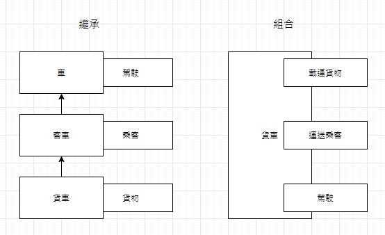

# Hello-Go

一個Go語言的基礎筆記。

> 筆記作者：葉高緯 Wei the Shinobi

# 介紹

Go的編譯速度很快，還有內置多執行緒，類型系統簡單高效率，還有GC回收。

## goroutine

Go的多執行緒，

goroutine之間透過**通道**溝通，

不需要鎖也能操作同一個資源，

但要注意如果傳遞的是數據的指標時，

如果讀和寫是不同goroutine完成，

則需額外的同步動作。

## 鴨子類型

在GO中實現某個接口不需要去宣告，只要實現就好。

其他語言把這特性叫做鴨子類型。

GO的語言接口(interface)通常只會描述單一動作，

GO的接口更小，更利於組合。

## 類型簡單

其他語言要一層層繼承，

在GO中設計小類型然後組合成大東西。




# 變量聲明

```go
var a int
```

默認值為0

```go
var c = 100
```

智慧型別

```go
d := 100
```

省去`var`關鍵字，最常用。

全域變量無法使用這個方法。

```go
const age int = 18
```

常量宣告，唯讀。

```go
const (
    A = 0
    B = 1
    C = 2
)
```

常量實現枚舉。

```go
const (
    A = iota // 0
    B        // 1
    C        // 2
)
```

只需要這樣寫就好，

`iota`會從0自動遞增。

# Function

```go
func test(a string, b int) int {
    c := 100
    return c
}
```

簡單的範例

```go
func test(a string, b int) (int, int) {
	fmt.Print(a)
	fmt.Print(b)
	c := 100
	d := 200
	return c,d
}
```

多個回傳值的示範

```go
func main() {
   ret1, ret2 := test("abc", 200)
   fmt.Print(ret1,ret2)
}
```

>  **注意：你沒辦法宣告一個沒用到的變數，如果宣告了就必須要使用到，否則報錯。**

```go
func test(a string, b int) (c int,d int) {
	fmt.Print(a)
	fmt.Print(b)
	c = 100
	d = 200
	return
}
```

你可以**替返回值命名**。 

# Import

順序：main -> import 直到最後一個import -> const -> var -> init() -> 上一個package -> 重複直到main

> **注意：你沒辦法導入一個你用不到的package，導入了就得使用，除非你使用匿名。**

```go
import (
    _ "test1"      // 匿名 無法使用包的方法 但會使用包的init()
    hello "test2"  // 別名
    . "test3"      // 將"test3"包的方法導入當前的包中，可以直接使用，不需要test.method()，但如果同名很麻煩，不建議。
)
```

你可以替`import`取別名。

# defer

`defer`關鍵字會在函式結束時執行。

```go
defer fmt.Println("a")

fmt.Println("b")
```

輸出

```go
b
a
```

**多個defer會先進後出**，這是個Stack。

## 與return比較

當`return`和`defer`同時出現時，

`return`先，**最後才是`defer`**。

# 數組與切片

```go
// 一個固定長度的數組
var myArray1 [10]int

myArray2 := [10]int{1,2,3,4}

// 基本的遍歷數組
for i := 0; i < len(myArray1); i++ {
    fmt.Println(myArray1[i])
}

// range遍歷數組
for index,value := range myArray2 {
    fmt.Println(index,value)
}
```

## 切片 slice

```go
// 動態數組 切片
mySlice1 := []int{1,2,3,4}
var mySlice2 []int
```

> **注意：切片是地址傳遞的，傳入方法時要注意。**

使用`make`來分配空間

```go
mySlice2 := make([]int,10)
```

---

### len 與 cap

`len`是目前切片已經存在的長度，

`cap`是切片每次擴容的大小。

```go
var numbers = make([]int,3,5)  // make(型別,len,cap)
```

當第一次`cap`滿了，

就會擴容，

擴容的長度會增加一倍。

### 切片擷取

```go
fmt.Println(numbers[1:3])
```

可以使用類似python的方法。

### 深度複製

因為切片是地址傳遞，

包括複製的情況，

所以要擷取複製的話需要用到`copy`函式來深度複製，

這樣才會得到兩個不同位址變數，

否則這兩個變數的地址指向同一個。

```go
copy(a,b) // 將b的值依序複製到a中
```

# Map

```go
var myMap map[string]string  // 宣告了一個map

myMap2 := make(map[string]string,10) // 後面的10可以省略
```

使用前要分配空間，使用`make`關鍵字。

```go
	myMap2 := map[string]string{
		"a": "a",
		"b": "b",
	}
// 這也是一種方式
```

示範如何刪除與修改

``` go
delete(myMap,"a") // 刪除

myMap["b"] = "c"  // 修改或增加
```

> **注意：`map`也是一個地址傳遞。**

# struct

你可能在C語言中看過這個，你想的沒錯！

```go
type Book struct {
    title string
    author string
}

var book1 Book
book1.title = "Go"
book1.author = "monkey"
```

# Go 的物件導向


待更新...


