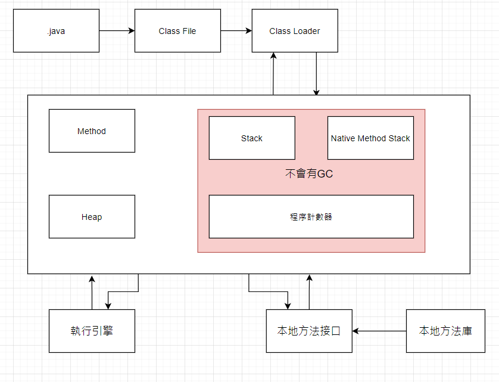
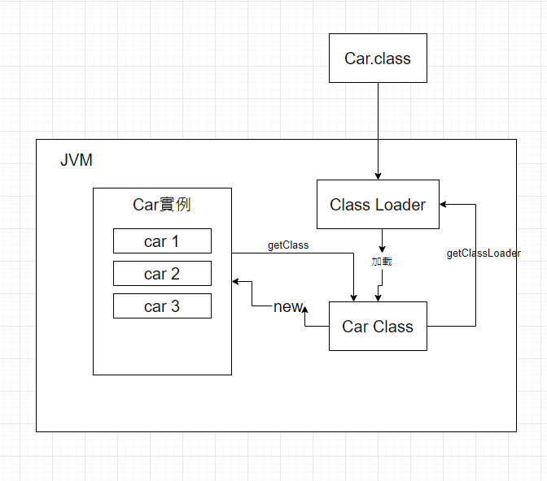

# JVM

> 筆記作者：葉高緯 Wei the Shinobi
>
> 參考資料：[【狂神说Java】JVM快速入门篇](https://www.bilibili.com/video/BV1iJ411d7jS)
>
> 延伸閱讀：《*深入理解 Java 虛擬機：JVM 高級特性與最佳實踐*》

# JVM 結構

# 加載器與雙親委派

加載器：

- 根加載器
- 擴展類加載器
- 應用程式加載器

雙親委派：

- 先找根加載器，如果沒有
- 找擴展類加載器，如果沒有
- 找應用程式加載器（我們寫的程式）
- 如果都沒有，ClassNotFoundException

# Native 關鍵字

1. 凡是帶了native關鍵字，說明Java的作用範圍達不到了，**調用底層C語言的庫**。
2. 進入**本地方法棧**(native method stack) 
3. 調用**本地方法接口JNI**(native method interface)

JNI作用：擴展Java的使用，融合不同的語言為Java所用。

Java開闢了一個標記區域：native method stack，登記Native方法，

在最終執行時，加載本地方法庫中的方法通過JNI。

# 方法區

方法區被所有線程共享，靜態變量、常量、類信息和常量池存在方法區中，

但是**實例變量**存在**堆**中，和方法區無關。

static, final, Class, 常量池

# 待更新

