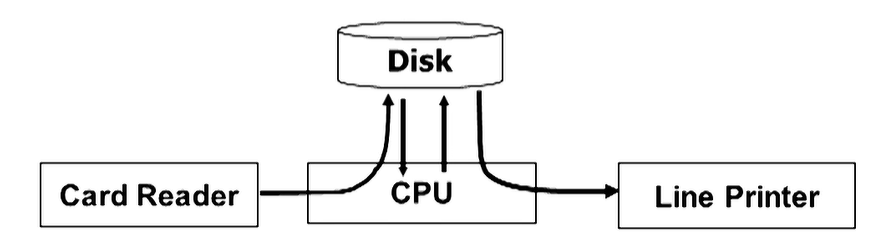

# Operating System

> [10510周志遠教授作業系統_第1A講 Syllabus&Ch0: Historical Prospective - YouTube](https://www.youtube.com/watch?v=3PfL2WIS22o&list=PLS0SUwlYe8czigQPzgJTH2rJtwm0LXvDX&index=1&ab_channel=NTHUOCW)

## Historical Prospective

> Mainframe System：早期的電腦又大又慢而且單純

### Batch System

- 一次處理一個工作，程式是插卡片讓機器讀取
- 無法互動
- 因為靠讀取卡片，所以 IO 非常慢，CPU 常常閒置

### Multi-Programming System

為了提高 CPU 的使用率，

把需要執行的任務一次讀進記憶體中

IO 給其他物件做，

CPU 執行重要的任務

### Time-Sharing System

一次只執行一個任務有很多的不方便

所以讓 CPU 能夠快速切換任務

每個做一點不斷切換

是現代電腦的實現

### System

- SMP

多個同等的 CPU 一起計算

用於消費級的 CPU

- AMP

一個主 CPU 管理多個 CPU

注重效能

- Many-Core Processor

超多處理器集合在一起，舉例來說 GPU

適合用來處理 Array 計算

- 分散式系統

不同電腦透過網路接起

P2P 或 client-server

## Introduction

