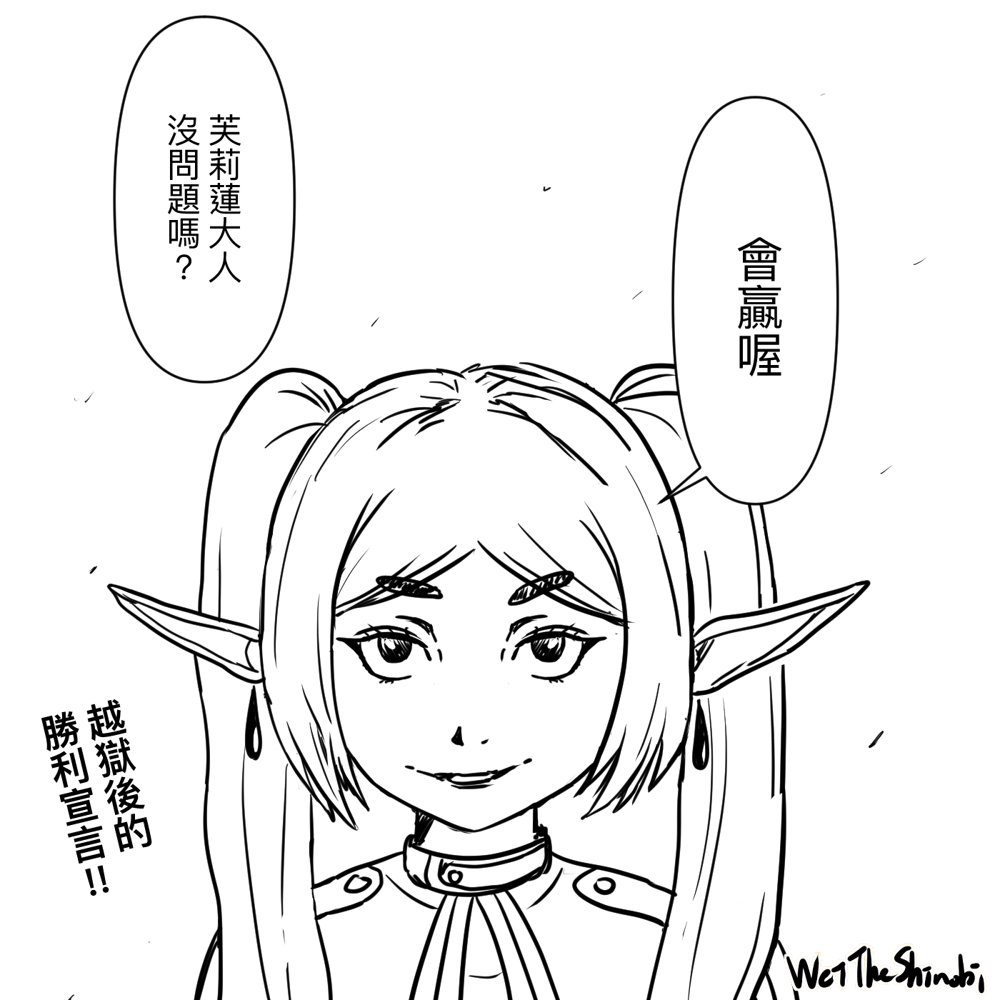
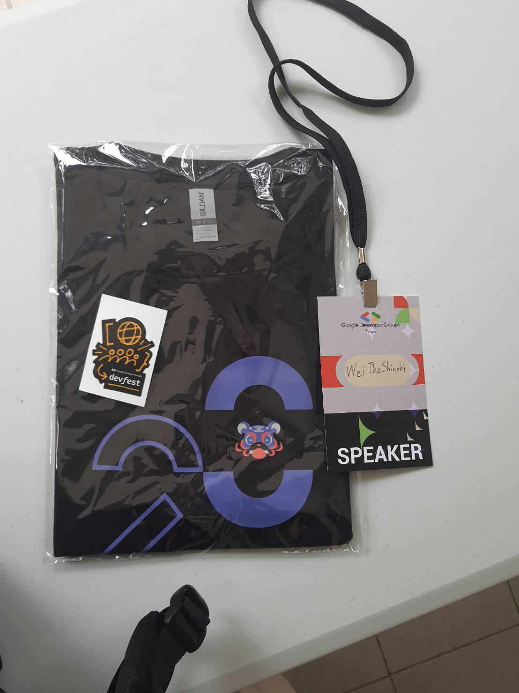
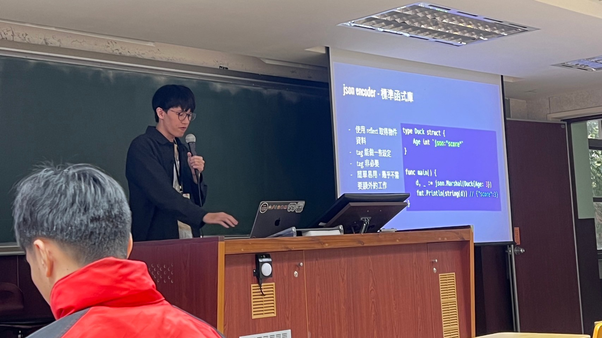
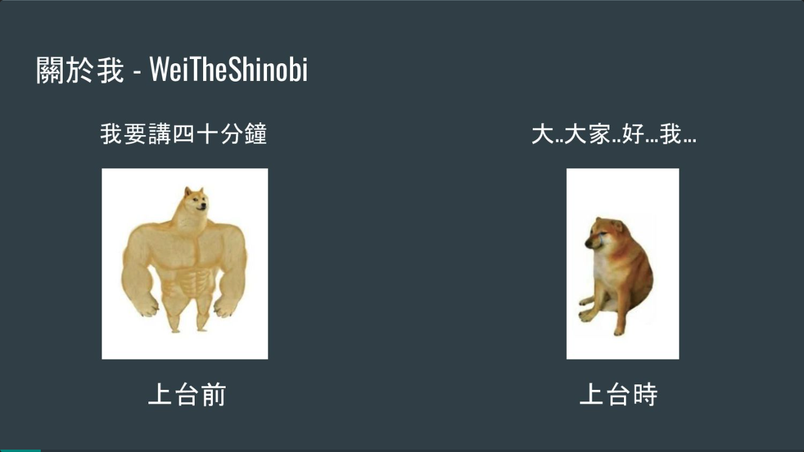

# 我ㄉ第一次演講：Golang Framework 是怎麼做出這些酷功能？

哈囉，算上這篇，今年也發了九篇文了，真棒鴨！

這是一篇簡單的心得，2023 的最後我到了 DevFest Taipei 演講，主題是「Golang Framework 是怎麼做出這些酷功能？」，在那前兩天也有先在 golang 社群的 meetup 講過一次，所以在 DevFest 相較沒那麼緊張，有人說比兩天前更好，我自己也覺得。

我在做投影片想到：為了避免緊張忘詞，乾脆把要講的重點都寫上去，就不會忘詞了，每個句子都像我腦中的索引一樣。這是一個只看投影片也能懂的 talk，連結放在最後，有興趣可以看看，我在投影片中也塞了一些梗，不僅有料也有趣。

總之這是一個很好的體驗，從一開始模糊的內容，到後來看了一堆 source code、擷取 code、寫範例等等，隨著時間內容越來越明確，前一天還超晚睡，其他講者也表示有同樣情況，看來不只是我哈哈，一路上受到很多人的幫助。因為看了很多 code，還因此貢獻了兩個 PR，真是奇妙的體驗。

2024 也要加油鴨！最後感謝 33 幫我拍照，是好朋友鴨！

投影片連結：[Github](https://github.com/WeiTheShinobi/speech_how-does-golang-framework-achieve-cool-feature)

 WeiTheShinobi

