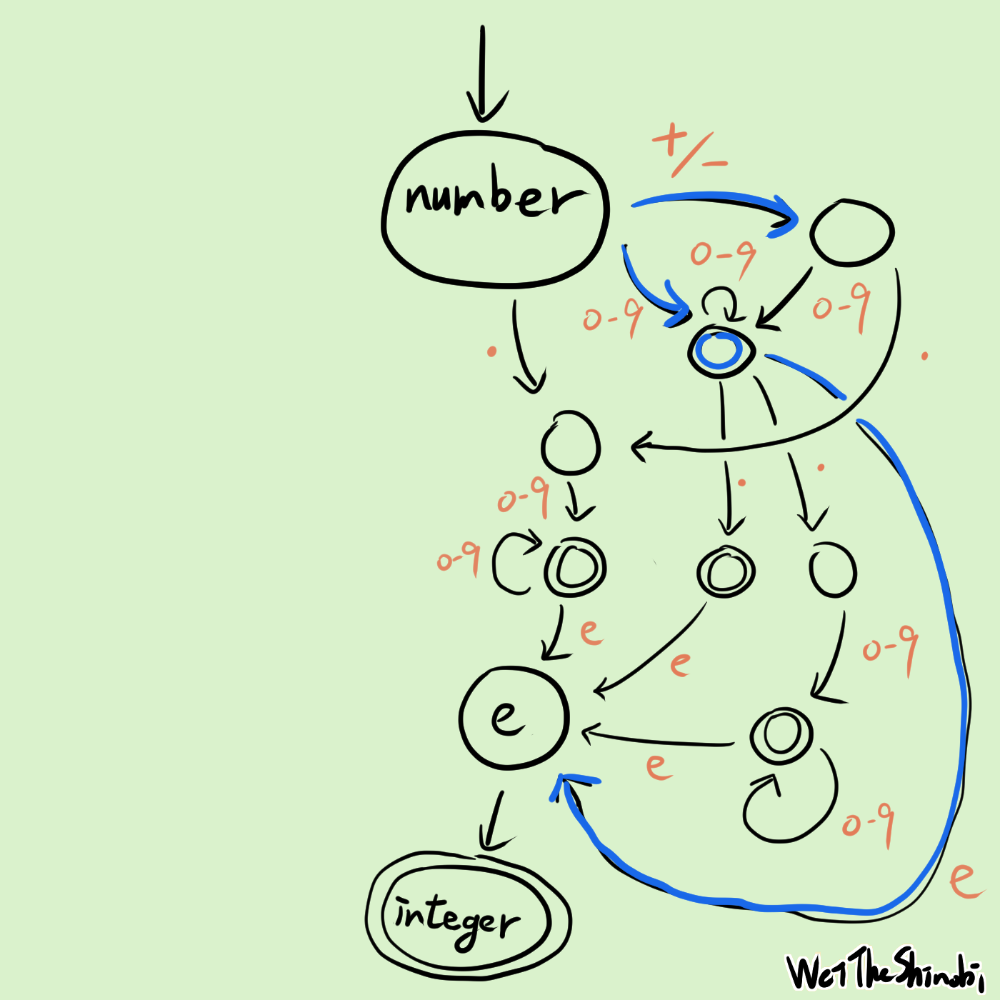
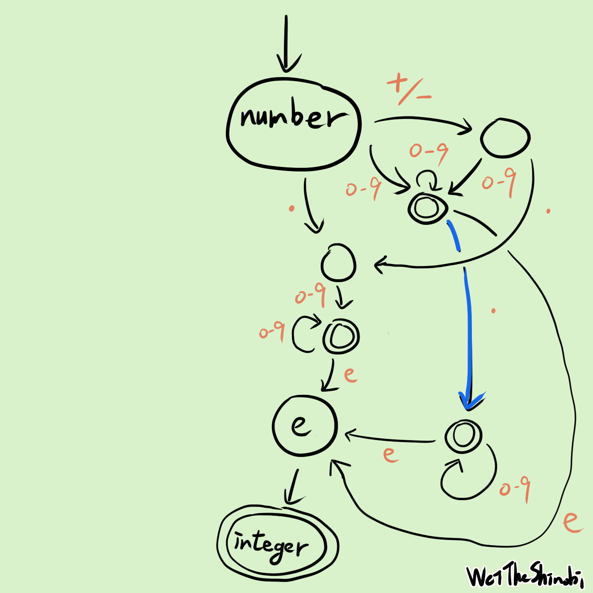
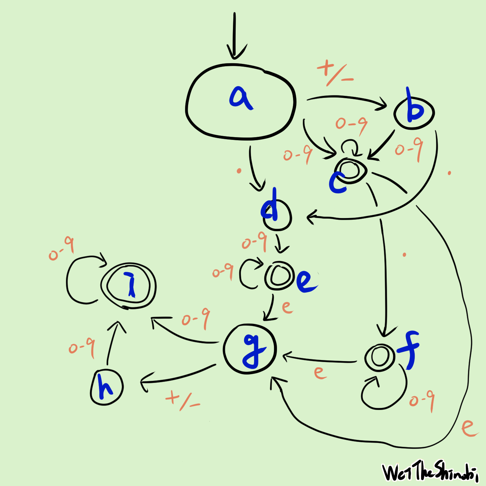

# LeetCode 65. Valid Number 手把手帶你使用狀態機


狀態機！啟動！LeetCode 第 65 題，合法的數字：今天選的這個題目還蠻有趣的，可以用一堆 `if else` 來判斷得到答案，但有一堆 edge case 而且也很醜、寫起來更是難受，但也可以用**狀態機**：就是這次的主題，也許你會在**編譯器**或 **AWS step function** 中聽過。我希望帶大家用簡單的方式和類比，來了解這些有趣的事物，只需要懂一點程式就能看懂。探索未知總是令人興奮！

## 簡單講解題目

[Valid Number - LeetCode](https://leetcode.com/problems/valid-number/)

輸入一個字串，判斷是否是一個 number，輸出布林值。

number 可以是一個 decimal 或一個 integer，後面可以選擇要不要加 `e`。

decimal 可以是選擇加上 `+/-`，且會是以下三擇一：

- 一個或以上的 digits + `.`
- 一個或以上的 digits + `.` + 一個以上的 digits
- `.` + 一個或以上的 digits

integer 可以選擇加上 `+/-`：

- 一個或以上的 digits

## 正規表示式

如果英文字母 A 到 Z 是一個英文字母的集合，那單字就是英文字母的排列組合，像是 apple 是英文字母組合成的，接續著說，一個句子就是單字集合照著某些規則組合而成的排列組合，可以想像我們從一本字典中選出一些單字，然後組合起來，像是`I like duck`，可能有一些主詞、受詞、動詞啊這些從小學到大的觀念，如果能夠照著規則，我們就能很輕鬆的表達出這題，**我們只要照著規則把程式碼寫下來就好了**。先用簡單的方式，試著用符號來表達題目的意思，這裡使用正規表達式。

>可以把正規表示式當成一個方便又實用的工具，用來判斷輸入的字串是否有按照規則，所以我們可以用正規表示式來判斷輸入的字串是不是一個 number。

在方便的今天，如果想知道某些規則的正規表示式怎麼寫（像是合法的 email），只要問 LLM 就能輕鬆得到想要的答案。以下節錄至 ChatGPT 的回答：

> 你可以使用正则表达式来验证给定的字符串是否是有效的数字。根据你的条件，以下是一个可能的正则表达式：
>
> ```
> ^[+-]?(\d+\.\d*|\.\d+|\d+)([eE][+-]?\d+)?$
> ```
>
> 这个正则表达式的含义如下：
>
> - `^` 和 `$`：表示字符串的开始和结束。
>
> - `[+-]?`：表示可选的正负号。
>
> - ```
>   (\d+\.\d*|\.\d+|\d+)
>   ```
>
>   ：表示数字的整数部分和小数部分，它可以有以下三种形式之一：
>
>   - `\d+\.\d*`：至少一个数字，一个小数点，然后零个或多个数字。
>   - `.\d+`：一个小数点，然后至少一个数字。
>   - `\d+`：至少一个数字。
>
> - `([eE][+-]?\d+)?`：表示指数部分，它是一个大写或小写字母 "e"，后面跟着可选的正负号和至少一个数字。
>
> 略 ...

感謝 2023！噢耶！

> 了解形式語言，非常的有趣！
>
> 推薦閱讀：[形式語言：現代工程師可以用程式語言、不需要用紙帶打洞來寫程式都要感謝它 - 寫點科普 Kopuchat](https://kopu.chat/形式語言：現代工程師可以用程式語言都得感謝它/)

所以我們的第一個作法，正規表示式如下：

```go
// LeetCode 65. Valid Number

func isNumber(s string) bool {
	return regexp.MustCompile("^[+-]?(\\d+\\.\\d*|\\.\\d+|\\d+)([eE][+-]?\\d+)?$").MatchString(s)
}
```

## 有限狀態機

狀態機是一種數學模型，用來描述物件在不同狀態之間轉換的行為，幫助我們簡化複雜與管理的問題：

可以看到狀態、事件、轉換、結束狀態，剛開始只要瞭解基本規則即可。

> 有興趣可以搜尋關鍵字：**DFA**, **NFA**。


換個角度想想，在不同的狀態下得到同樣的東西也許會有不同的結果，餓了拿到錢可以買食物，但吃飽了就不會再買食物，同樣都是錢在**不同的時空背景下會做不同的事情**，刀可以是兇器，也可以保護人，~~當我拿著刀就無法擁抱你~~，就看當下的情況。在接下來會詳細的講解狀態機。

## 畫圖

只要按照題目的意思做即可，首先 number 可以是 decimal 或 integer，所以我們可以看看 decimal 和 integer 的開頭：


- number 是 decimal 或 integer，可以選擇再加上 e + integer
- decimal 可以選擇 sign，接下來是 digit 或 dot
- integer 可以選擇 sign，接下來只能是 digit

把拆解的結果畫出來：


終於弄好了，看起來超複雜的，左邊是 integer 的路線，右邊則是 decimal，照著題目規則畫上去，每個圈圈代表一個狀態，不同狀態中間有許多路來轉換。

選到什麼字符就往哪走，一直走到沒有字符為止。雙重圈圈代表這個狀態可以是結束的狀態，如果走到這個狀態剛好沒有結束了，恭喜成功！代表機器接受了這個字串，反之走到一個圈的狀態就結束，代表出錯了，無路可走也是錯誤的。

舉例來說：我們從 number 開始，當你遇到什麼符號，就選擇往哪邊走，如果字串是`+5`，一開始就可以往左或右邊走，因為第一個字符是`+`，下一個符號是`5`，如果當下的狀態可以接受（像是`0-9`），那我們就有路可走，選擇超多的。

但現在有個問題，我們很難預測到底要選擇哪條路走，像是剛剛說的例子，假如一開始拿到`+`，到底要往左還是往右呢？當然也可以把每條都走過一次看看有沒有成功的案例，這也是一種做法，或者我們也可以簡化一下這張圖。行吧，不如就把狀態合併吧，這樣就不用走這麼多路了嘿嘿！



先處理左半邊那塊，在初始狀態中有兩條是`0-9`，也有兩條是`+/-`，我們可以把他們合併，藍色的線是合併的樣子。與其說是合併，不如想像一下，我們把不同的狀態放到同一個集合中。


這條路上有兩個`.`，合併！



這兩個狀態可以視為等價。


最後把底下那個 integer 攤開來，這樣每個狀態的每條路都是**確定的**、沒有岔路，我們不用把每條路都走過一次來猜測，太好了！我們可以開始寫程式囉！

## 按圖施工，馬到成功

現在就按照這個圖把程式碼寫出來就好了，把每個狀態寫出來，把每個狀態的路徑寫出來，標記一下哪些狀態可以是結束。最後寫下演算法，這個演算法也很簡單。



首先把每個狀態定義好，我已經用藍色把每個狀態標記起來：

```go
	const (
		a = iota
		b
		c
		d
		e
		f
		g
		h
		i

		digit = "0123456789"
		sign  = "+-"
		eE    = "eE"
		dot   = "."
	)
```

接下來把路徑寫下來，只要照著圖抄下來就好了。

```go
	type Path struct {
		tokenSet  string
		nextState int
	}

	nextPath := map[int][]Path{
		a: {{sign, b}, {digit, c}, {dot, d}},
		b: {{digit, c}, {dot, d}},
		c: {{digit, c}, {dot, f}, {eE, g}},
		d: {{digit, e}},
		e: {{digit, e}, {eE, g}},
		f: {{digit, f}, {eE, g}},
		g: {{digit, i}, {sign, h}},
		h: {{digit, i}},
		i: {{digit, i}},
	}
```

寫下每條 path 接收哪些 token，當接收這個 token 會去哪個狀態，照著我們剛剛畫的圖即可。

```go
	isFinalState := map[int]bool{
		c: true,
		e: true,
		f: true,
		i: true,
	}
```

我們把圖中的雙重圈圈記錄下來，這表示此狀態可以是結束狀態，如果在雙重圈圈結束代表是正確的。
