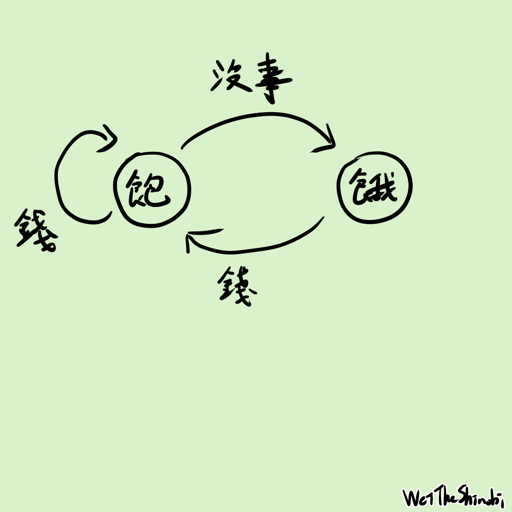
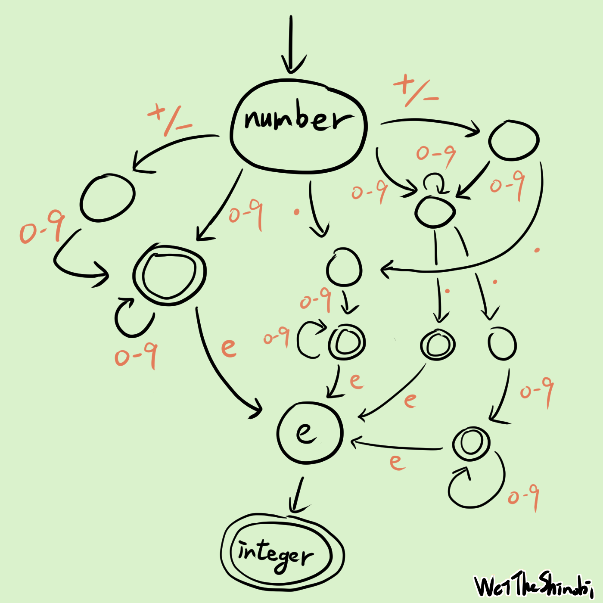
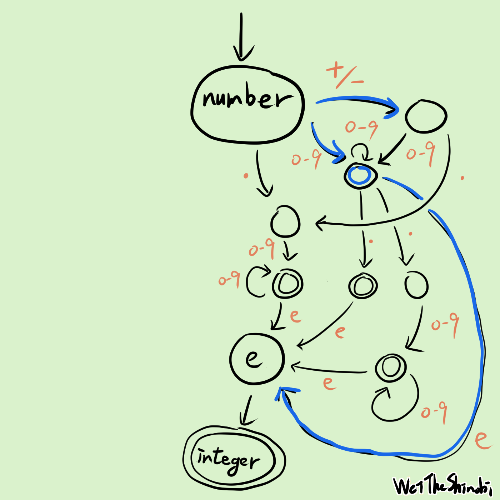
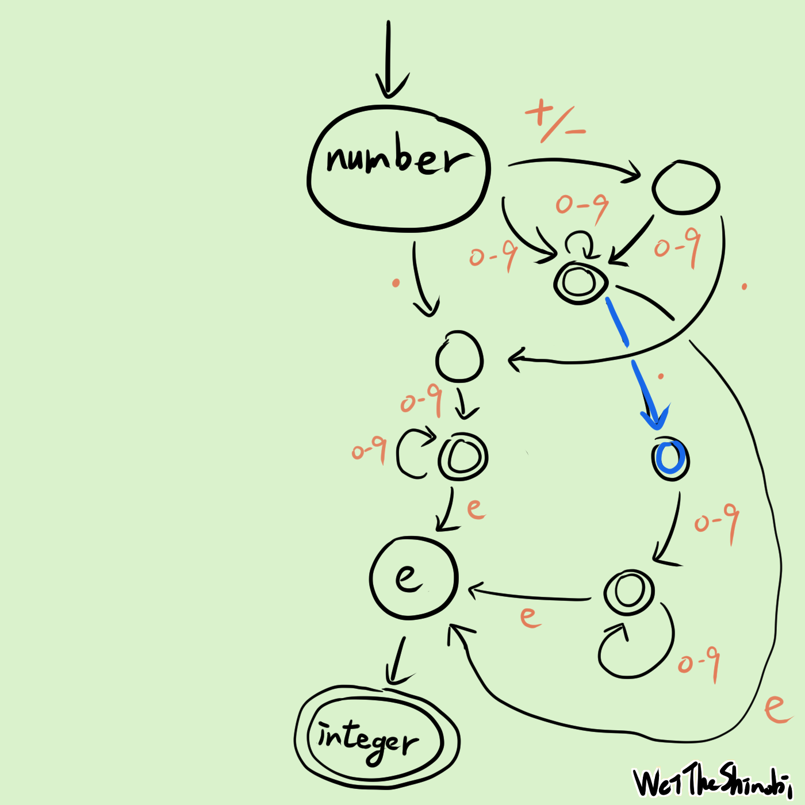
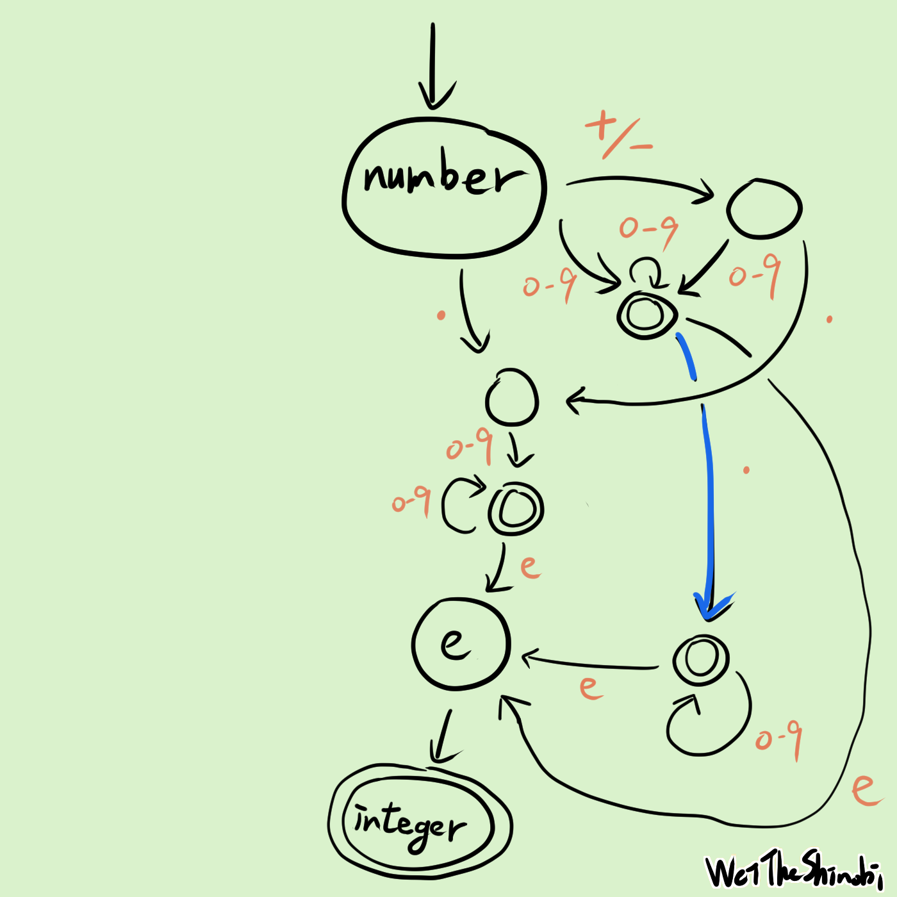
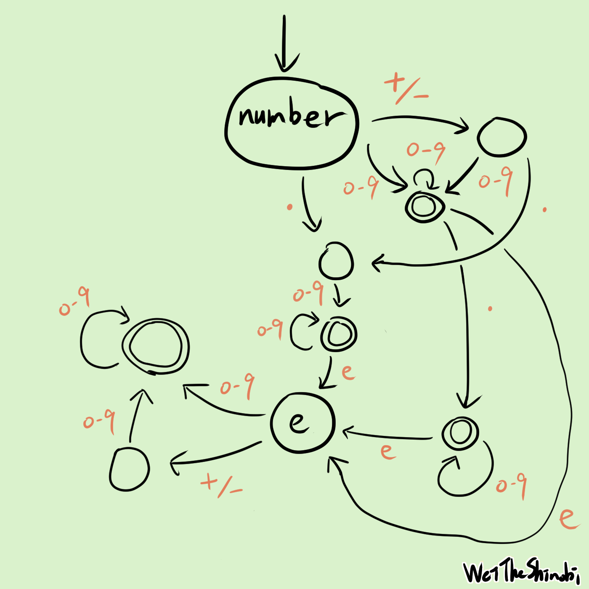

# 手把手帶你使用狀態機！以 LeetCode 65. Valid Number 示範


狀態機！啟動！LeetCode 第 65 題，合法的數字：今天選的這個題目還蠻有趣的，可以用一堆 `if else` 來判斷得到答案，但這個作法會有一堆 edge case 難以處理，而且也很醜、寫起來更是難受，但也可以使用**狀態機**：就是這次的主題，也許你會在**編譯器**或 **AWS step function** 中聽過。我希望帶大家用簡單的方式和類比，來了解這些有趣的事物，只需要懂一點程式就能看懂。探索未知總是令人興奮！

## 簡單講解題目

[Valid Number - LeetCode](https://leetcode.com/problems/valid-number/)

輸入一個字串，判斷是否是一個 number，輸出布林值。

number 可以是一個 decimal 或一個 integer，後面可以選擇要不要加 `e`。

decimal 可以是選擇加上 `+/-`，且會是以下三擇一：

- 一個或以上的 digits + `.`
- 一個或以上的 digits + `.` + 一個以上的 digits
- `.` + 一個或以上的 digits

integer 可以選擇加上 `+/-`：

- 一個或以上的 digits

## 正規表示式

如果英文字母 A 到 Z 是一個英文字母的集合，那單字就是英文字母的排列組合，像是 apple 是英文字母組合成的，接續著說，一個句子就是單字集合照著某些規則組合而成的排列組合，可以想像我們從一本字典中選出一些單字，然後組合起來，像是`I like duck`，可能有一些主詞、受詞、動詞啊這些從小學到大的觀念，如果能夠照著規則，我們就能很輕鬆的表達出這題，**我們只要照著規則把程式碼寫下來就好了**。先用簡單的方式，試著用符號來表達題目的意思，這裡使用正規表達式。

>可以把正規表示式當成一個方便又實用的工具，用來判斷輸入的字串是否有按照規則，所以我們可以用正規表示式來判斷輸入的字串是不是一個 number。

在方便的今天，如果想知道某些規則的正規表示式怎麼寫（像是合法的 email），只要問 LLM 就能輕鬆得到想要的答案。以下節錄至 ChatGPT 的回答：

> 你可以使用正则表达式来验证给定的字符串是否是有效的数字。根据你的条件，以下是一个可能的正则表达式：
>
> ```
> ^[+-]?(\d+\.\d*|\.\d+|\d+)([eE][+-]?\d+)?$
> ```
>
> 这个正则表达式的含义如下：
>
> - `^` 和 `$`：表示字符串的开始和结束。
>
> - `[+-]?`：表示可选的正负号。
>
> - ```
>   (\d+\.\d*|\.\d+|\d+)
>   ```
>
>   ：表示数字的整数部分和小数部分，它可以有以下三种形式之一：
>
>   - `\d+\.\d*`：至少一个数字，一个小数点，然后零个或多个数字。
>   - `.\d+`：一个小数点，然后至少一个数字。
>   - `\d+`：至少一个数字。
>
> - `([eE][+-]?\d+)?`：表示指数部分，它是一个大写或小写字母 "e"，后面跟着可选的正负号和至少一个数字。
>
> 略 ...

感謝 2023！噢耶！

> 了解形式語言，非常的有趣！
>
> 推薦閱讀：[形式語言：現代工程師可以用程式語言、不需要用紙帶打洞來寫程式都要感謝它 - 寫點科普 Kopuchat](https://kopu.chat/形式語言：現代工程師可以用程式語言都得感謝它/)

所以我們的第一個作法，正規表示式如下：

```go
// LeetCode 65. Valid Number

func isNumber(s string) bool {
	return regexp.MustCompile("^[+-]?(\\d+\\.\\d*|\\.\\d+|\\d+)([eE][+-]?\\d+)?$").MatchString(s)
}
```

## 有限狀態機

狀態機是一種數學模型，用來描述物件在不同狀態之間轉換的行為，幫助我們簡化複雜與管理的問題：

可以看到狀態、事件、轉換、結束狀態（雙重圈圈的狀態），剛開始只要瞭解基本規則即可。

> 有興趣可以搜尋關鍵字：**DFA**, **NFA**。



換個角度想想，在不同的狀態下得到同樣的東西也許會有不同的結果，餓了拿到錢可以買食物，吃了食物會轉移你的狀態，從餓到飽，**不同的時空背景下會做不同的事情**，刀可以是兇器，也可以保護人，~~當我拿著刀就無法擁抱你~~，就看當下的情況，接下來我們會看到何謂狀態機、視覺化的流程。

## 畫圖

只要按照題目的意思做即可，首先 number 可以是 decimal 或 integer，所以我們可以看看 decimal 和 integer 的開頭：


- number 是 decimal 或 integer，可以選擇再加上 e + integer
- decimal 可以選擇 sign，接下來是 digit 或 dot
- integer 可以選擇 sign，接下來只能是 digit

開始拆解，照著這三點把結果畫出來，decimal 稍微複雜一點，他有三條路和選配一個正負號，integer 比較簡單，至於要怎麼畫圖呢？現在我們拿 integer 示範：

> integer 可以選擇加上 `+/-`：
>
> - 一個或以上的 digits

integer 一開始選擇可以接受 `+/-`，那如果不選`+/-`的話也可以接受`0-9`，所以可以畫出兩條路：

- 初始狀態接受`+/-`的路
- 初始狀態接受`0-9`的路

接下來因為`+/-`後可以接受`0-9`，所以替他加上一條路。而 digit 可以是一個或多個以上，所以這個狀態可以再畫出路，那會有多少個 digit 呢？難道有多少 digit 就要畫出多少的狀態嗎？不用，可以把這些狀態合併成指向他自己。

而 decimal 同理，把初始狀態可以接受的 token 列出來：

> decimal 可以是選擇加上 `+/-`，且會是以下三擇一：
>
> 1. 一個或以上的 digits + `.`
> 2. 一個或以上的 digits + `.` + 一個以上的 digits
> 3. `.` + 一個或以上的 digits

可以知道初始狀態可以接受`+/-`，第 1, 2 點可以接受 digits，第 3 點可以接受 `.`，這代表初始狀態可以有三條路走，然後我們再按照這個規則延伸，**如果可以接受 token，就有路**。~~路是人走出來的~~

下圖中：integer 是左半邊， decimal 是右半邊。



終於弄好了，看起來超複雜的，左邊是 integer 的路線，右邊則是 decimal，照著題目規則畫上去，每個圈圈代表一個狀態，不同狀態中間有許多路來轉換。

選到什麼字符就往哪走，一直走到沒有字符為止。**雙重圈圈代表這個狀態可以是結束的狀態**，如果走到這個狀態時剛好字串也結束了的話，那代表機器接受了這個字串；反之走到單獨一個圈的狀態剛好結束，代表拒絕，**還沒結束便無路可走也是拒絕的**。

舉例來說：我們從 number 開始，當你遇到什麼符號，就選擇往哪邊走，如果字串是`+5`，一開始就可以往左或右邊走，因為第一個字符是`+`，下一個符號是`5`，如果當下的狀態可以接受（像是`0-9`），那我們就有路可走，選擇超多的。

這裡附上一個視覺化的範例，示範一個狀態機能否接受字串`abc`：


因為最後的狀態可以是終態，所以機器接受。

但現在有個問題，我們很難預測到底要選擇哪條路走，像是剛剛說的例子，假如一開始拿到`+`，到底要往左還是往右呢？當然也可以把每條都走過一次看看有沒有成功的案例，這也是一種做法，但是會走得很累、腿很酸。又或者我們也可以簡化一下這張圖呢？行吧，不如就把狀態合併吧，這樣就不用走這麼多路了嘿嘿！



先處理左半邊那塊，在初始狀態中有兩條是`0-9`，也有兩條是`+/-`，我們可以把他們合併，因為他們都接受同樣的 token。藍色的線是合併的樣子。與其說是合併，不如想像一下，我們把不同的狀態放到同一個集合中。



這條路上有兩個`.`，合併！



這兩個狀態可以視為等價。



最後把底下那個 integer 攤開來，這樣每個狀態的每條路都是**確定的**、沒有岔路，我們不用把每條岔路都走過一次來猜測，太好了！我們可以開始寫程式囉！

## 按圖施工，馬到成功

最後的做法就稍微簡單一點了，現在按照這個圖把程式碼寫出來即可，把每個狀態寫出來，把每個狀態的路徑寫出來，標記一下哪些狀態可以是結束，最後寫下演算法。


首先把每個狀態定義好，我已經用藍色把每個狀態標記起來：

```go
	const (
		a = iota
		b
		c
		d
		e
		f
		g
		h
		i

		digit = "0123456789"
		sign  = "+-"
		eE    = "eE"
		dot   = "."
	)
```

寫下所有的狀態，還有 token set。

```go
	type Path struct {
		tokenSet  string
		nextState int
	}

	nextPath := map[int][]Path{
		a: {{sign, b}, {digit, c}, {dot, d}},
		b: {{digit, c}, {dot, d}},
		c: {{digit, c}, {dot, f}, {eE, g}},
		d: {{digit, e}},
		e: {{digit, e}, {eE, g}},
		f: {{digit, f}, {eE, g}},
		g: {{digit, i}, {sign, h}},
		h: {{digit, i}},
		i: {{digit, i}},
	}
```

接下來把路徑寫下來，在這裡定義每個狀態的路接受哪些 token set，接受了會到哪條路上。

```go
	isFinalState := map[int]bool{
		c: true,
		e: true,
		f: true,
		i: true,
	}
```

我們把圖中的雙重圈圈記錄下來，這表示此狀態可以是結束狀態，如果在雙重圈圈結束代表是正確的。

```go
	// 初始狀態
	currState := a
	for _, token := range s {
		paths := nextPath[currState]
		hasPathToGo := false
		for _, path := range paths {
      // 檢查當下的 token 可不可以走這條路，如果有，進入那個狀態
			if strings.ContainsRune(path.tokenSet, token) {
				currState = path.nextState
				hasPathToGo = true
				break
			}
		}
    // 發現當下狀態無路可走，拒絕
		if !hasPathToGo {
			return false
		}
	}
	// 結束 檢查有沒有停在雙重圈圈中
	if !isFinalState[currState] {
		return false
	}
	return true
```

最後是狀態機的演算法，走訪字串的每個符號，檢查當前狀態能否接受此符號，如果能接受就到下一個狀態，反之則拒絕，最終結束時，如果狀態可以是結束狀態，則表示這個字串被接受，反之。

最後附上完整的程式碼，希望大家都能自己從零到 accept，慢慢思索，成就感滿滿！

WeiTheShinobi

```go
func isNumber(s string) bool {
	const (
		a = iota
		b
		c
		d
		e
		f
		g
		h
		i

		digit = "0123456789"
		sign  = "+-"
		eE    = "eE"
		dot   = "."
	)

	type Path struct {
		tokenSet  string
		nextState int
	}

	nextPath := map[int][]Path{
		a: {{sign, b}, {digit, c}, {dot, d}},
		b: {{digit, c}, {dot, d}},
		c: {{digit, c}, {dot, f}, {eE, g}},
		d: {{digit, e}},
		e: {{digit, e}, {eE, g}},
		f: {{digit, f}, {eE, g}},
		g: {{digit, i}, {sign, h}},
		h: {{digit, i}},
		i: {{digit, i}},
	}
	isFinalState := map[int]bool{
		c: true,
		e: true,
		f: true,
		i: true,
	}

	currState := a
	for _, token := range s {
		paths := nextPath[currState]
		hasPathToGo := false
		for _, path := range paths {
			if strings.ContainsRune(path.tokenSet, token) {
				currState = path.nextState
				hasPathToGo = true
				break
			}
		}
		if !hasPathToGo {
			return false
		}
	}
	if !isFinalState[currState] {
		return false
	}
	return true
}
```

