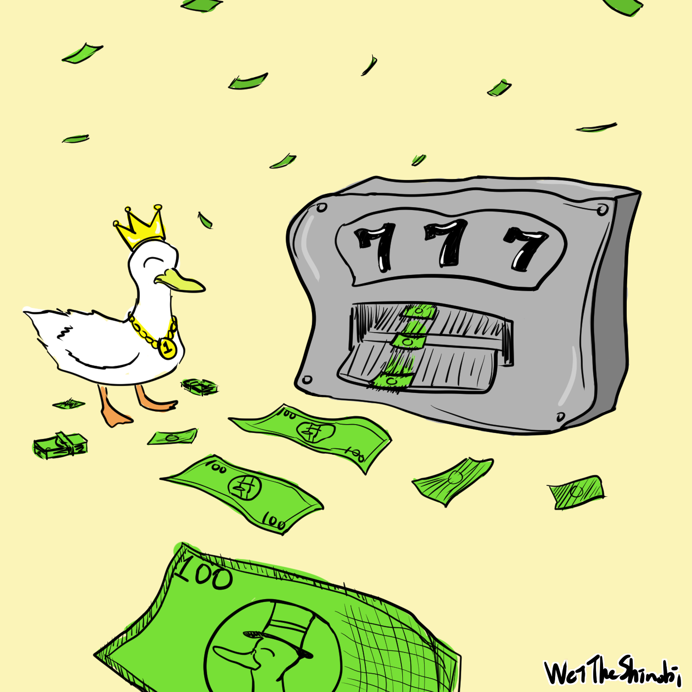

# 也許程式交易不是你想找的那個印鈔機

為什麼寫這篇文章呢？最近在思考投資股票，其中我的投資策略會參考某些指標，但老實說每次都要開某些網站還蠻麻煩的，難道我就不能一個按鈕下去，就能知道我要的指標嗎？所以我就很快速地寫了一個計算的程式，寫完之後我就想，既然都要參考某些指標來交易了，幹嘛不做成自動化交易就好了，然後就想到了程式交易，剛好朋友也有在和我討論，與其只跟他講不如跟大家講哈哈。

## 何謂程式交易？

現在拿出手機打開券商的 app，下單，程式交易完成。

沒錯，但這應該不是一邊人想像的，與其說是程式交易，不如說是自動化交易。

只要把平常做的事情自動化即可：

- 首先是搜集資料，下單總要看一下股價吧！把平常會看的資訊收集起來。
- 整理出需要的指標，有了股價、交易量這些東西，就可以畫成圖、計算想要的指標、回測，可以上網找找看公式，把擁有的資料照著計算即可。舉例來說移動平均線就是簡單的加法和乘法，把每天的點算出來就可以畫成圖，就跟在財經網站上看到的一樣。

>  延伸學習：
>
>  更有效率的計算移動平均線：[K Radius Subarray Averages - LeetCode](https://leetcode.com/problems/k-radius-subarray-averages/)
>
>  簡單的說，計算移動平均線時，不用每次都全部算完，只要計算差異的部分即可。（與這題類似）
>
>  當然**在這個情況可以不用這麼複雜**，因為移動平均線頂多看個幾百幾千天，電腦使用沒效率的做法也可以很快地完成。
>
>  我的解答放在最下方，如果你要練習請不要先看喔！

- 有了需要的指標，就可以決定何時要下單，這部分就是簡單的條件判斷：如果符合條件就做某些事
- 剛剛提到的某些事，可以寫程式連線到券商下單、發出訊息給常用的通訊軟體

不難發現，就只是把平常做的事情交給程式做而已，先看各種指標、價格，然後看看自己的投資策略，有的人是定期定額、有的人是量化交易，然後看完了手動下單，現在全都交給機器來做，這四個步驟可以自己選擇和客製化。

## 想想看需要什麼

如果只是覺得學了程式就可以在證券市場靠交易賺錢，我覺得是不可能，不需要被焦慮感給控制。但是學習程式是很開心的事情，我覺得得失心不用太重，好奇心就像食慾一樣，得到新的資訊總是使人開心，如果覺得無聊，學習這是一個很好的選擇！

## 程式只是工具

終歸來說，最重要的還是策略，程式只是幫忙自動化的部分，如果能夠下單賺錢，那自動跟手動會有差嗎？（高頻交易例外，不過我覺得普通人很難參與到這塊，可以忽略。）程式只是幫忙省去麻煩，像是計算指標、下單等等。你不會因為自動化交易就突然賺錢，那也是因為策略本來就是賺錢的。

## 總結

使用自動化交易並不會使你突然大賺一筆，關鍵在於**交易策略**，自動化交易只是省去手動的麻煩，讓你能夠睡得安穩（前提是程式有寫好，不然可能睡覺更差）

WeiTheShinobi

```go
// LeetCode 2090. K Radius Subarray Averages
// https://leetcode.com/problems/k-radius-subarray-averages/
// golang
func getAverages(nums []int, k int) []int {
	result := make([]int, len(nums))
	sum := 0

	for i := 0; i < k+k+1 && i < len(nums); i++ {
		sum += nums[i]
	}

	for i := 0; i < len(nums); i++ {
		if i < k {
			result[i] = -1
			continue
		}
		if i + k >= len(nums) {
			result[i] = -1
			continue
		}
		result[i] = sum / (k+k+1)
		sum -= nums[i-k]
		if i + k + 1 >= len(nums) {
			continue
		}
		sum += nums[i+k+1]
	}

	return result
}
```

