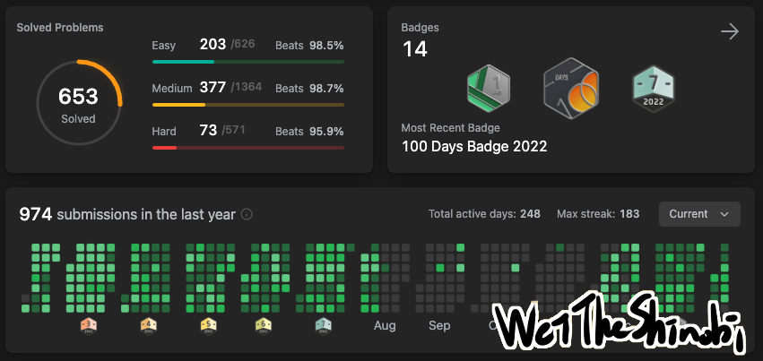

# 為什麼你應該刷題？超乎想像的巨大收益

> 「*老師啊，感激不盡，如今的我，就能挑戰星星。*」—「碎星」拉塔恩

刷題指的是上 LeetCode 做題目，這個網站提供演算法題目和競賽，不管是初學者或是頂尖大神都能找到挑戰。想想我也做了六百來題了，今天來談談刷題究竟改變了我什麼、我認為的學習方向，我得說，本來以為只是做做題目，最後的結果遠超我的預期，不過都是我的主觀看法啦。

## 故事從何而起

我認為這是一種長期收益的投資，你並不會因為多學一題而能夠馬上展現差別，但是你做一個專案馬上就可以博人眼球。但我得說**刷題是非常值得的**，我沒騙你！這也是我寫這篇文章的原因。

我也是看到其他人在講 LeetCode，覺得好像挺有意思才開始刷題的。一開始我覺得難的不得了，連個 easy 題目都做不出來，後來就每天學習，一天一點點的累積其實效果非常顯著，並且讓自己每天至少都能做一題。

經歷過這些也讓我開始思考，我對電腦開始有更多不同的看法，原來寫程式的重點不在寫程式，而是在背後的數學和證明。程式只是實現想法的工具，**重要的是把數學的模型放到電腦上**，**離散數學**受用無窮。

## 達成前置知識

我覺得刷題就像重量訓練，而學框架、專案那些的就像練習用兵器，當然能打出一套招式很帥，不過重訓讓你力氣大，**力氣大的人學什麼兵器都能事半功倍**。在我大量練習後，動手的能力變強很多，很多事都變簡單了。

這是一個正向的循環，因為覺得簡單所以更傾向去學習更多，而學更多會覺得更多事情變簡單。就好像類銀河惡魔城的遊戲，**以前開不了的門必須在之後取得某些力量或鑰匙才能打開**，學習到的不只是資料結構與演算法，而是**打開後面關卡的鑰匙**。

在我看資料庫開發的線上課程時，就聽過一句話：「會開發資料庫，什麼都能開發。」聽起來很合理，因為開發資料庫需要涵蓋大範圍的知識，並行、ACID、怎麼持久化到硬碟、SQL等等，這些不同的知識點融會貫通才能做出資料庫。

## 歸納與推理

我曾經聽過一個故事：「關於防範駭客，為什麼不自己發明一種符號，這種符號和其他程式不共通，這樣系統就安全了。」

乍聽之下好像蠻合理的，但其實是行不通的，因為電腦中的符號（a, b, c, 1, 2, 3...）只是 bit 排列組合的子集，而自己發明的符號也會落在這個子集中，一個簡單的舉例來說：現在你設計一個特殊符號`@`是`1001`，假如 b 是`10`，a 是`01`的話，你的這個特殊符號`@`就等價於`ba`而已，**不論設計多麽複雜的符號，最終都會在`01010101010110....`排列組合的子集中**。

說這個故事是想表達，當擁有足夠的基礎知識，就能夠推理出很多事情、舉一反三，用公理推測新的事物而不是硬背，現在能學到的都是前人的肩膀，想想開創新的事物是多麽困難？需要多少的前置知識呢？**牛頓被蘋果砸到不是偶然**。

## 有些事情不會改變

許多軟體工程師會遇到的問題，一直追新的技術太累了，十年前用的技術與現在不同，當然開發工具也更好用很多。我覺得我對這個問題的解決方法就是：**加快學新東西的速度**，而加快速度的方法就是建構你的知識譜系。

你讀小說的速度會比你讀不熟悉領域的論文還快，因為你已經熟悉你的母語了，不用看兩行字就跑去 google，所謂的新東西就是在原有的知識中增加或修改一些，這個領域都會依賴這個知識譜系的核心（除非整個核心都替換了），**新的東西出來你可以推理**，就知道大概是怎麼樣；**可以根據以往的經驗歸納**，並不會花很多時間學習，這就是學習核心原理的好處，Vue, Spring, Django 等等的框架會改變，但核心的知識不會，這是非常棒的收益。

## 欣賞美麗的世界

> 「*沒有技藝，靈感不過是風中搖曳的蘆葦。*」 —約翰尼斯‧布拉姆斯

這個世界是很美麗的，心流的感覺非常愉快，在你學習的路上，去思考前人的是怎麼想的，讚嘆怎麼可以如此的精巧，這種快樂難以形容。希望大家都能找到自己的方向，**有創新的想法卻無法實現是非常可惜的一件事**，我希望自己有一天靈感到來時，能有夠能力去做出來。

WeiTheShinobi
