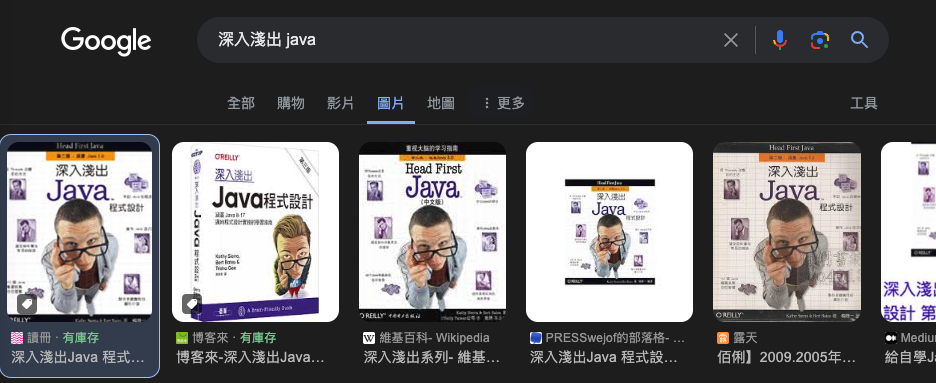

# 學習寫程式是什麼感覺

講什麼很難、痛苦、學習很快樂過於俗套，不同階段都有心態上的轉變。

## 踏上征途

回顧我的初心，一開始我是為了做出酷東西而開始學習寫程式的，不是錢不是職涯，畢竟那時資訊工作也還沒那麼火熱。真要說的話也是看上軟體只需要一台電腦就能有很高的上限，想學木工要的工具材料可不少呢。

跟很多人一樣，我的母語是 c 語言，從別地方複製過來的 `#include <stdio.xxx>`，完全不知道這幹嘛的，反正程式可以跑編譯沒錯就好，當然未定義行為又是另一回事，非常折磨，要我說寫 clang 就很像吃飯之前要先跳舞祈禱下雨，沒有任何提示告訴你哪裡跳錯了，而你只知道整鍋飯味道毀了。

宣告一個陣列要詠唱、宣告一個變數要先畫法陣、糟糕的開發體驗，不難但很麻煩，clang 實在痛苦太多、收穫太少。

後來轉向《深入淺出 Java》，沒錯我就是從那個深入淺出系列書籍開始的，還是從學校圖書館借的，書中有精美的繪圖和範例，不得不說這本書是我的啟蒙導師，我就像一個住在 clang 家樓梯下儲藏室的受虐兒童，Java 有天闖入這裡說我其實是個巫師帶我離開這裡。Java 的安全性就像一片雲朵把我接住，總是在我犯錯時糾正我，內建的函式庫提供我的日常所需。

「我真的可以這麼幸福嗎？」我一邊問到一邊流下眼淚。

從此我成為了一個工具的使用者，不是理解原理，而是單純的使用著 compiler 和虛擬機，順手地寫著程式碼。

## 錯誤的期待

時間來到工作了一段時間後，我發現其實這一切沒有想像中美好，我不是說寫程式變成工作很無聊，依然很有趣！但就是其他地方跟期待不一樣。

首先要了解，每間公司的商業邏輯不一樣，有的公司靠破壞性的創新服務，有的靠法規賺錢，有的公司賺的是投資人的錢，也有提供勞力賺錢的。你也可以以此為標準來反向猜測公司的文化。

再來是，公司營利的目的是賺錢，這裡不是實驗室，只要有錢醫生也能說抽煙很健康（一百年前的香菸廣告如是），而以賺錢為導向的話，寫的程式也要以此為導向，不要執著在漂亮、易維護，大部分專案不需要也不想要這樣，商業有它的生命週期，我覺得很多人並不了解。

再來是技術能力的部分，要知道大部分人並不是很厲害，你的主管可能只是在公司待得比較久，或者他就是公司的創辦人。技術跟薪水有相關性，但也要知道兩點：

- 相關不一定顯著
- 有相關性不代表有因果性

>  舉例來說，那斯達克指數上漲的比下降的還多，我每天都會吃飯，所以得出我吃飯左右了那斯達克的結論。

這世界就像是個大戲台子，很多事情並不像是宣傳的那樣，當然有需要嚴謹的地方，但更多情況是達到標準就好。

人在剛踏入一個新領域時知道自己什麼都不懂、謙遜，然後學了一點皮毛便認為自己無所不能，接著慢慢認知到自己所不知道，最後走向大師之路，所以如果你發現某個人很喜歡講大話，他如果不是爛的無知，就是超厲害的大師，而前者的機率明顯比後者高的多，大師都是二八法則中的二八法則中的二八法則。

基於以上，如果你一直把不相關的兩件事綁在一起（錢跟能力），那現實和想像的不一致感、撕裂感所帶來的認知失調，只會讓你很痛苦而已。

但也別太難過，最終我還是找到了一片淨土，學習大學的科目、貢獻 open source 專案是我覺得最有趣的事情，不管是難度或是成就感都比工作更加滿足，或許我不是討厭寫程式，而是討厭寫「那些程式」，我曾經因為焦慮而東學西學，最後繞了一大圈，又回到原點。

## 心態上的轉變

或許我們早就習慣衝刺，畢竟這就是大部分人從小到大受到的教育：「做完這個就不用再努力了。」

我以前就是一直抱持這個想法去學東西，從為了找工作弄一些專案，趕快學好 Android 就可以上架 app，覺得學了這個就可以爽，覺得把這個弄熟以後可以暢快寫程式一定很有趣。

確實，熟練之後的確是很輕鬆，但這痛苦的過程讓我覺得沒法堅持很久，我好像為了做而做，總是心猿意馬、有一個鬧鐘不斷滴答滴答地提醒我，為了衝刺而忽略的途中的景色，我卻一直沒意識到這件事。

今年我開始跑馬拉松，學習跑步、在山林裡奔跑，這也讓我有很多時間思考。

人生也是一場馬拉松，或者說不只是馬拉松：而是超級馬拉松，上百公里的超級耐力賽。其實不用顧慮短時間的衝刺，比這更重要的是取得一個良好的習慣，運動、學習、照顧心理健康，維持住 momentum 不斷往強，而不是專注在一點點的短期利益上，犧牲了長期。

衝刺一段痛苦一段休息一段，不如慢慢地跑、愉快的跑，這樣才能減少心靈上的消耗，開心愉快的成長。

跑步跑到死的新聞並不罕見，但我從沒看過有人走路走到死，如果你覺得自己跑累了，那就跑慢一點。

WeiTheShinobi