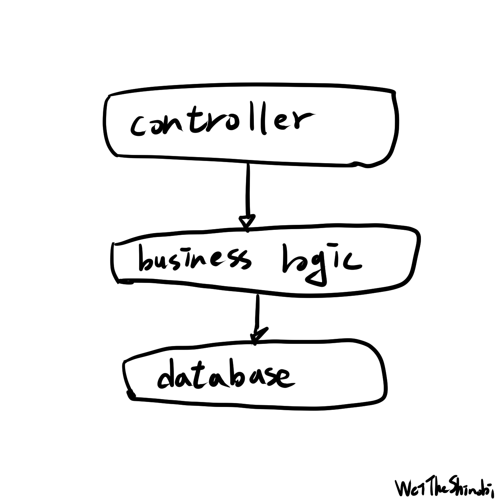

# Clean Architecture 替我解決的痛點

WeiTheShinobi

Clean Architecture 是我讀的一本書，這本書講了架構、SOLID、作者的自傳等等，我來分享一些我得到的新東西，也許這比較像是讀書心得或是我對自己的碎碎念。

## 被資料庫綁架

我想這是出發點問題，很多人應該看過以下這種依賴關係：

 

這是你常常會看到的做法，甚至是網路上很多的範例也是這樣，程式可以跑、可以正確執行，我不知道你有沒有這樣想過，但我總是覺得這種做法卡卡的，不管是開發中或是日後維護，總是有種說不出的怪，為什麼改起來怪怪的？接手起來好痛苦啊！需求改動總是像大地震一樣，最終變成一團義大利麵。商業邏輯依賴於資料庫表、直接使用資料庫表的 model 輸出，語意不明確又容易出錯。

## 以領域為主

以主要的商業邏輯做出發點，寫出邏輯與資料結構，你不需要知道你的資料是從 MySQL 還是 Redis 來的，你只需要知道有個東西會給你資料。你也不需要知道你的資料會送到瀏覽器、桌面應用還是 RPC，你只知道把資料交出去就對了。把主要的邏輯與 IO 的部分解耦，讓外部依賴領域邏輯，也不要讓外部插手領域邏輯，這樣你才能在日後改變的更少，為何？這與依賴關係有關。

## 所謂依賴

並不是把程式分開來寫就真的解耦了，重點在於依賴關係，這與你用微服務或是單體無關，上游改動下游就會受到影響，所以管理依賴很重要，如果把常常變動的元件當作核心會很痛苦的，在 Go 語言中你的迴圈依賴是過不了編譯器的。

## 簡單點

我覺得寫 code 還是要取捨，功能就只是簡單的讀取資料就簡單寫，不要過度設計，在動態中逐步成長，一開始就弄一堆有的沒的也許之後也用不到了，還讓接手的人覺得困擾，一堆不必要的 interface 在 trace 的時候是挺困擾的，記得那句話：「你現在不需要」，我覺得其實寫程式還是很自由的，但不代表做什麼都可以，遵守基礎的原則然後發揮創意，就像畫畫一樣。

## 測試程式碼

我基本上是那種會「一邊寫測試一邊開發」的人，所以測試的痛我有感觸，我常常覺得測試寫起來難以維護，測試依賴於產品程式碼，所以測試維護寫得不好維護成本超高，維護超累就懶得弄，懶得弄測試就沒意義了，寫測試也是需要思考與練習的。別讓測試特定化，這也是我常犯的錯，太過訂製的測試會一改就廢，測試需要 mock 、輸入輸出都需要想想，我現在寫測試都會思考如何讓測試更好維護。

## 聊聊框架

以前用 Java Spring Boot 框架，那時就覺得這根本是魔法，怎麼可以這麼方便啊！加上一個註解就幫我做好多事，依賴注入還有開箱即用真的很舒服，後來我開始寫 Go，我動手實作以前那些所謂的「魔法」，注入物件、初始化，不知道為什麼心裡反而有種踏實的感覺哈哈哈哈，畢竟以前都是讓框架來替我管理，大概是因為自己從頭寫到尾真的理解了吧，回到正題，我想說少即是多，也許是時候開始思考你到底需要什麼，就像家裡面有一堆放很久沒用到的東西，之後大概也用不到，可以丟掉了。

推薦大家都可以看看這本書

參考資料：《Clean Architecture》