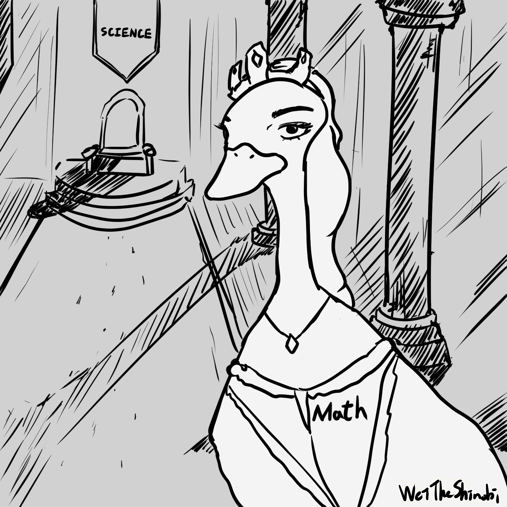

# 你有想過為什麼一個數能被3整除嗎

還記得小時候在數學課上學過，如果一個數的所有位數相加能被 3 整除，那它就是就是 3 的倍數。這個公式大家應該都記得，但你有想過為什麼嗎？它的原理何在？該怎麼解釋？本篇會用直白的口吻來帶大家了解這個小數學！

## 先了解取模

**模除（modulo）**即是兩數相除的餘數，根據**除法原理**，我們知道一個數可以被分成`n = ax + b`，所以`n / a = x + b`，可以知道`n mod a = b`，這就像是數學課會看到的`8 / 3 = 2 ... 2`這樣的式子。在一些程式語言中，你可以看到 mod 運算以`%`表示。取模是一個應用廣泛的運算，生活中常見的例子就是**分組**，舉例來說：一個班級要分成三組，**每個人的號碼 mod 3，會發現只會得到 0, 1 或 2，這樣就成功分成三組了**。小到計算最大公因數、大到密碼學都會用到取模。

## 數學課教的公式

數學課學到：一個數字的所有位數相加，只要計算這個**數字 mod 3 是否等於 0**，就能知道此數**能否被 3 整除**，如果用 153 為例：我們把`1 + 5 + 3 = 9`，因為 9 是 3 的倍數，所以 153 能被 3 整除。接下來我們來看看這是如何推論的。

## 所以如何推導

我們知道 mod 有交換律，即：

- `(a+b) mod c = [(a mod c) + (b mod c)] mod c`

- `ab mod c = [(a mod c)(b mod c)] mod c`

以剛剛的 153 為例：

## 結語

恭喜你看完這篇文章，又學習到了有趣的小數學了，我想跟你說，你非常厲害喔！如果覺得很有趣的話，**數論**、**離散數學**是很好的學習方向，可以多多深入了解喔！

WeiTheShinobi