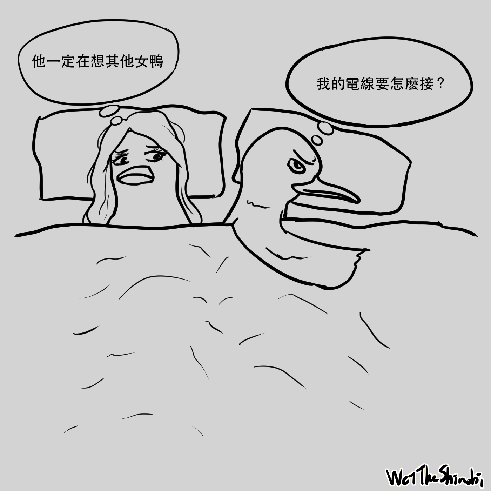

# 如何在 Steam 上玩接電線？《Turing Complete》

作為一個 Steam 重度用戶，我平時沒事就是逛逛商店，某次意外的發現這個超讚的遊戲，就被這樸實的畫面所吸引，又因為我本就喜歡建造經營類的遊戲，舉例像是《Rimworld》就是個超讚的遊戲，我十分推薦。而這次發現的遊戲就是《Turing Complete》，就是常常聽到的那個圖靈完備，在遊戲中玩家扮演一個實驗體，作為一個被外星人抓來研究的地球生物，將為了保住小命而做出圖靈完備的計算機。

## 一個接電線的遊戲

說起來遊戲在幹嘛？這就是一個接電線的遊戲。玩家會從一開始的邏輯閘關卡，一步一步領導你，組合不同的邏輯閘變成小元件，不同的小元件組合後，成為一台計算機，你會了解到二進制、二補數、解碼、一堆錯綜復雜的線路、寄存器等等，你也會知道什麼是 opcode、地址、組合語言、stack，你會在遊戲中遇上不同的難關，而你也需要不斷擴充自己的機器才能過關，如果你本來就對程式有點概念，在過關後，就會有種**昇華的感覺**，非常得愉快，就像是得到了不得了的東西的愉快感。

## 這遊戲在做什麼

遊戲中並沒有太多的引導，只有任務說明和簡單的術語解釋，玩家需要大量的試錯和思考來完成關卡，如果你本身對於寫程式沒有什麼概念，玩家可以會在中途某些關卡卡住一段時間。玩家需要寫下「對應機器」的組合語言，所謂的「對應機器」就是玩家造好的那台電腦，這可不像在 2023 寫程式那麼方便，因為一切都是玩家設計的，在開始寫邏輯之前需要對照指令集定義一大堆有的沒的，這些做完才能開始用彆扭的方式寫程式。

隨著遊戲深入，玩家會需要更好的處理器架構，同時也要能加上記憶體，才能夠完成後面更加艱難的關卡。

## 總結

### 優點

- 耐玩、遊戲時數高
- 價格便宜
- 高難度帶來高成就感
- steam workshop 社群

### 缺點

- 不太好用的 UI
- 遊戲指引少
- 劇情薄弱

這是一款客群較小眾的遊戲，如果你是對於解謎、puzzle 感興趣的玩家，那我十分推薦這款遊戲給你，這遊戲會花掉很多時間在思考，屬於**喜歡會非常喜歡，不喜歡完全不想碰**的遊戲。

Steam 商店連結：[Turing Complete Steam 商店頁面](https://store.steampowered.com/app/1444480/Turing_Complete/)

WeiTheShinobi

